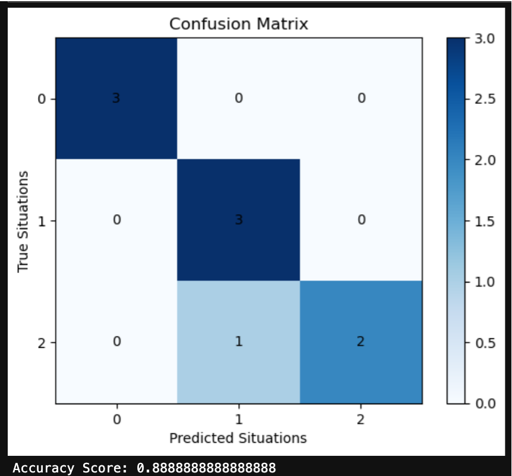

## Table of Contents

- [Brief Overview](#brief-overview)
- [Key Features of SA-IoTDG](#Key-Features-of-SA-IoTDG)
- [Getting Started](#getting-started)
  - [Prerequisites](#Prerequisites)
  - [Installation](#Installation)
- [Usage](#usage)
  - [Generating Data](#Generating-Data)
- [Experimental Results and Validation](#Experimental-Results-and-Validation)
- [Intended usage and useful scenarios](#Intended-usage-and-useful-scenarios)
- [Acknowledgements](#Acknowledgements)

## TL;DR

SA-IoTDG is a tool enabling the simulation of IoT data for applications by replicating real-world IoT scenarios. For detailed information, refer to the associated [Publication](https://www.mdpi.com/1424-8220/23/1/7).

## Brief Overview

*  Conducted a thorough analysis of real-time data streams to gain insights into the distribution patterns inherent in the data.

*  Employed advanced statistical techniques to generate synthetic data that replicated the identified patterns and trends observed in the real-world dataset.

* The generated data was evaluated using a real-world traffic monitoring scenario.
  
## Key features of SA-IoTDG:

- **Situation Description System:** Defines and characterizes various states and transitions within the IoT application's operational context.
- **SysML Model:** Captures the functional and non-functional requirements of the IoT application for data generation. The framework integrates a SysML model to capture and represent IoT application requirements effectively.
- **Markov Chain-Based Transition:** SA-IoTDG utilizes a Markov chain-based approach for smooth transitions in IoT data generation corresponding to different situations. It models the dynamic nature of IoT data by using a state-transition matrix to generate realistic data sequences, transitioning between situations based on their defined probabilities.

## Getting Started

**Prerequisites**
_docker_ (v. 17.05+) and _docker-compose_ should be installed

**Installation**
Run the following commands in the folder with _docker-compose.yml_ and _.env_ files from _release_ folder:

    docker-compose pull
    docker-compose up

UI will be available by the following url:
http://localhost:8090 or http://docker-machine-ip:8090
depending on the OS or docker version.

## Usage

**Generating data**

The tool allows data to be generated based on two methods:

**(1). Replay Data Generator**

In this method, a small sample of data is provided as a seed to the tool. This approach allows for generating data that closely mimics real-world scenarios and helps ensure that the generated data is relevant and useful for the intended IoT
application or users.

**(3). Situation based Data Generator**

This was developed by extending the [IoT data simulator tool](https://github.com/IBA-Group-IT/IoT-data-simulator/).

To generate data on the fly, navigate to **Add Situations** screen, then:

1.  Select the application for which data has to be generated
2.  Configure the situations;
3.  Select the situation transition parameters;
4.  You can select the frequency/no of data records to be generated
5.  Click on **Generate Data**.

<video width="640" height="360" controls>
  <source src="video_preview.mp4" type="video/gi">
  Your browser does not support the video tag.
</video>

<!--  -->

## Experimental Results and Validation

Experimental evaluations validate SA-IoTDG's ability to generate IoT data resembling real-world scenarios. The generated synthetic data was subjected to a comprehensive assessment within the context of a traffic monitoring scenario. This involved simulating conditions and scenarios relevant to traffic data, allowing for a detailed examination of how well the synthetic data aligned with the complexities of real-world traffic patterns.

<!--and enable performance evaluations of IoT applications on various middleware platforms.-->

<!-- We demonstrate SA-IoTDG using a real-world traffic monitoring scenario, showcasing its ability to generate realistic traffic data. -->

Extensive experimental evaluations confirm:

- SA-IoTDG's ability to generate data statistically similar to real-world traffic data.
- The effectiveness of using generated data for performance evaluation of deployed IoT applications on different middleware platforms.

For the first method of data generation, which is the **_replay method_**, the analysis revealed that the input data followed a Gaussian distribution; hence, data with the same distribution was generated.

  
   

For second method of data generation, which is the **_situation based method_**, the results demomstrated the relevant situation based data generation for IoT applications. We were also able to predict the next situations with an accuracy of 88%

  
   
   

<!--  -->

## Intended usage and useful scenarios

The project includes a demonstration using a real-world example for traffic monitoring scenario to showcase the practical application of SA-IoTDG.

## Acknowledgements

This tool is developed by extending the [IoT Data Simualtor Tool](https://github.com/IBA-Group-IT/IoT-data-simulator/).
